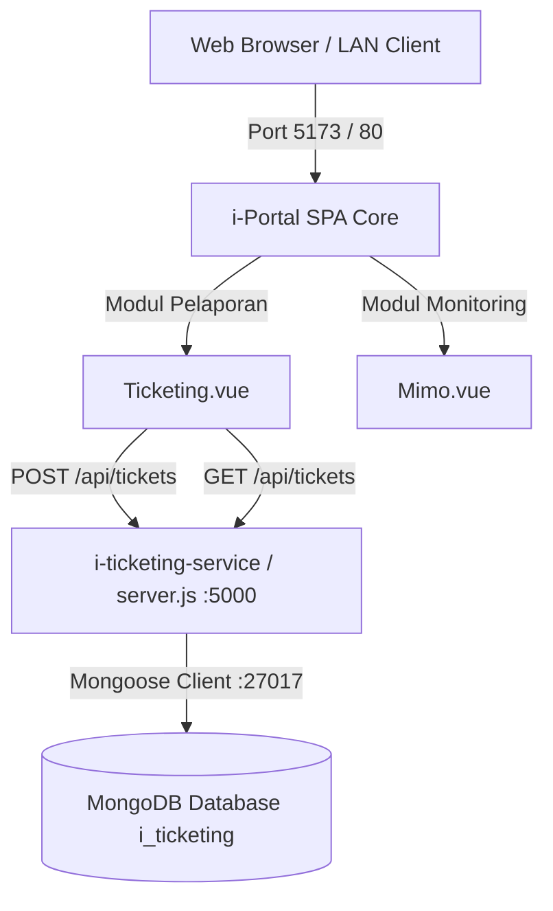

# Server & Project Audit Report — Review Before Implementation
**Target Directory**: `d:\laragon\www\i-portal`

---

## 1. Executive Summary

Berdasarkan audit komprehensif berstatus **Read-Only** terhadap repositori **i-Portal** (`d:\laragon\www\i-portal`):

1. **Kondisi Arsitektur Project**:
   - **Main Web Application**: Single Page Application (SPA) berbasis **Vue 3 + Vite + Vue Router** sebagai gerbang utama (*unified gateway*) sistem ISD WMC.
   - **Integrated Sub-Service (i-Ticketing)**: Terletak di `d:\laragon\www\i-portal\i-ticketing-service`, menggunakan backend Node.js Express REST API (`:5000`) dan MongoDB database (`:27017`).
   - **Integrated Sub-Service (i-MIMO)**: Terletak di `d:\laragon\www\i-portal\i-mimo`, menggunakan backend Go REST API (`:8080`), database MySQL/MongoDB, dan manifest Kubernetes.
2. **Temuan Audit Kritis**:
   - Skema MongoDB pada `i-ticketing-service/models/Ticket.js` telah dimodernisasi: `jumlah` (tipe `String`), `nomerHp` (wajib diisi / `required: true`), penambahan `moreDetails` dan `otherJenis`.
   - Endpoint root `GET /` dan `GET /health` telah tersedia pada `i-ticketing-service/server.js` untuk mencegah error `Cannot GET /` pada log systemd / health monitoring.
   - Repositori `d:\laragon\www\i-portal` saat ini **belum memiliki file `.gitignore`**, yang berisiko menyebabkan file sensitif seperti `ssh.md`, `.env`, atau folder `node_modules/` ter-track oleh Git.
3. **Status Implementasi**: **Tidak ada perubahan destruktif atau mutasi konfigurasi sistem yang dieksekusi**. Laporan ini menyajikan hasil audit dan rencana implementasi lengkap untuk ditinjau dan disetujui.

---

## 2. Server Specification

### A. Lingkungan Host & Workstation Lokal
- **Project Root Directory**: `d:\laragon\www\i-portal`
- **Sistem Operasi**: Windows NT 10.0 (x86_64)
- **Local Web Server Stack**: Laragon Suite (`D:\laragon\www\`)
- **Node.js Environment**: ESM Module (`"type": "module"`)

### B. Lingkungan Target Deployment (Server / Virtual Machine)
- **OS Target**: Linux Ubuntu 22.04 LTS (Jammy Jellyfish)
- **Hostname Target**: `vmmicro`
- **Container Runtime**: Containerd & Docker Engine
- **Orchestration**: Kubernetes v1.28 (`kubeadm`, `kubelet`, `kubectl`)
- **Network CIDR**: `10.244.0.0/16` (Flannel CNI)
- **Service Manager**: Systemd (`i-ticketing.service`)

---

## 3. Installed Tools & Software (Project Context)

| Kategori | Tool / Software | Versi / Rilis | Path / Lokasi | Peran dalam `i-portal` |
| :--- | :--- | :--- | :--- | :--- |
| **Frontend Framework** | **Vue.js** | `^3.4.0` | `package.json` | Framework UI reaktif utama portal |
| **Routing** | **Vue Router** | `^4.3.0` | `package.json` | Pengaturan navigasi & lazy load sub-modul |
| **3D Rendering** | **Three.js** | `^0.128.0` | `package.json` | Visualisasi 3D dashboard & background efek |
| **Build Tool** | **Vite** | `^5.0.0` | `package.json` | Bundler & local development server (`:5173`) |
| **Backend Runtime** | **Node.js Express** | `^4.19.0` | `i-ticketing-service/package.json` | Backend REST API i-Ticketing (`:5000`) |
| **ORM / ODM** | **Mongoose** | `^8.3.0` | `i-ticketing-service/package.json` | Konektor & validasi skema database MongoDB |
| **CORS Middleware** | **cors** | `^2.8.5` | `i-ticketing-service/package.json` | Middleware CORS untuk request cross-origin |
| **Sub-Service Runtime**| **Go (Golang)** | `v1.21+` | `i-mimo/backend/` | Backend engine microservice i-MIMO |

---

## 4. Running Applications & Services Structure

```text
┌─────────────────────────────────────────────────────────────────────────────────┐
│                          CLIENT BROWSER / LAN NETWORK                           │
└──────────────────────────────────────┬──────────────────────────────────────────┘
                                       │
                                       ▼
         ┌───────────────────────────────────────────────────────────┐
         │                    i-Portal Gateway                       │
         │                  (Vue 3 / Vite :5173)                     │
         └───────────────┬───────────────────────────┬───────────────┘
                         │                           │
                         │ HTTP REST (JSON)          │ HTTP REST (JSON)
                         ▼                           ▼
         ┌───────────────────────────┐   ┌───────────────────────────┐
         │    i-Ticketing Service    │   │      i-MIMO Service       │
         │  (Express Server :5000)   │   │     (Go Engine :8080)     │
         └───────────────┬───────────┘   └───────────┬───────────────┘
                         │                           │
                         ▼ Mongoose                  ▼ Driver
         ┌───────────────────────────┐   ┌───────────────────────────┐
         │    MongoDB Database       │   │    MySQL / MongoDB        │
         │   (Port 27017 / i_ticket) │   │     (Port 3306 / 27017)   │
         └───────────────────────────┘   └───────────────────────────┘
```

### Rincian Endpoint & Port:
1. **i-Portal Frontend**:
   - **Path**: `d:\laragon\www\i-portal`
   - **Dev Port**: `http://localhost:5173`
   - **Routes**: `/` (Dashboard), `/i-portal`, `/i-ticketing`, `/i-warehouse`, `/i-mimo`.
2. **i-Ticketing Microservice**:
   - **Path**: `d:\laragon\www\i-portal\i-ticketing-service`
   - **API Port**: `http://localhost:5000`
   - **Endpoints**: `GET /`, `GET /health`, `GET /api/master/units`, `GET /api/master/categories`, `POST /api/tickets`, `GET /api/tickets`, `GET /api/tickets/:id`, `PUT /api/tickets/:id`.
3. **i-MIMO Microservice**:
   - **Path**: `d:\laragon\www\i-portal\i-mimo`
   - **API Port**: `http://localhost:8080`

---

## 5. Architecture

Arsitektur sistem pada `i-portal` mengusung konsep **Integrated Micro-Frontend Gateway**:
1. **Frontend Hub**: `Dashboard.vue` bertindak sebagai launcher terpadu untuk seluruh aplikasi internal ISD WMC (i-Portal, i-Ticketing, i-MIMO, i-Warehouse, SIRS, dan link eksternal ISD WMC Linktree).
2. **Decoupled API Execution**: Modul `Ticketing.vue` melakukan panggilan API asinkron ke `i-ticketing-service` secara dinamis (`window.location.hostname:5000`), sehingga form dan fitur pelacakan tiket berfungsi mulus baik saat dijalankan di local machine maupun jaringan remote LAN/VM.
3. **Resilient Health Monitoring**: `i-ticketing-service/server.js` menyediakan route `/health` yang mengembalikan status koneksi database MongoDB secara real-time.

---

## 6. Project Structure (`d:\laragon\www\i-portal`)

```text
d:\laragon\www\i-portal\
├── App.vue                   # Root Vue Component dengan router-view
├── Dashboard.vue             # Central Dashboard Navigation & Action Buttons
├── Ticketing.vue             # Form IT Service Request & Live Tracking Status
├── Mimo.vue                  # Antarmuka monitoring antrean i-MIMO
├── router.js                 # Konfigurasi rute dan redirect fallback
├── index.html                # Entry point HTML template
├── main.js                   # Inisialisasi Vue & mounting aplikasi
├── vite.config.js            # Konfigurasi build Vite
├── package.json              # Daftar dependency frontend
├── package-lock.json         # Lock file versi dependency
├── CHAT_HISTORY.md           # Riwayat lengkap dokumentasi pengerjaan
├── UPDATE_I_TICKETING.md     # Rincian perubahan fitur & skema tiket
├── SERVER_AUDIT_REPORT.md    # Laporan audit project & server
├── i-ticketing-service/      # Backend microservice i-Ticketing
│   ├── models/
│   │   ├── Ticket.js         # Skema Mongoose Ticket
│   │   ├── Unit.js           # Skema Mongoose Master Unit
│   │   └── Category.js       # Skema Mongoose Master Kategori
│   ├── server.js             # Express API Server & Routing
│   ├── seed.js               # Database Master Seeder
│   └── package.json          # Dependency backend (express, mongoose, cors, dotenv)
└── i-mimo/                   # Sub-aplikasi i-MIMO
    ├── backend/              # Go REST Service & Dockerfile
    ├── frontend/             # Nginx Static Assets
    ├── kubernetes/           # K8s Manifests
    ├── docker-compose.yml    # Docker Compose multi-container
    └── db_checklist_seed.json# Master checklist seed data
```

---

## 7. Existing Configuration Audit

| Configuration | Value / Deskripsi | File Path | Service / Modul | Status / Catatan |
| :--- | :--- | :--- | :--- | :--- |
| **API Port** | `PORT: 5000` | `i-ticketing-service/server.js` | Backend API | Default port backend service |
| **MongoDB Connection** | `mongodb://localhost:27017/i_ticketing` | `i-ticketing-service/server.js` | Database | Koneksi database NoSQL lokal |
| **Hotline Emergency** | `+62 823-8170-7015` | `Ticketing.vue` | Frontend UI | Tautan aktif WhatsApp hotline |
| **External WMC Link** | `https://linktr.ee/isdwmc2025` | `Dashboard.vue` | Frontend UI | Tombol akses cepat ISD WMC |
| **Wildcard Catch-All**| `/:pathMatch(.*)* -> /i-ticketing` | `router.js` | Frontend Router | Mencegah blank viewport |

---

## 8. SSH.md & Gitignore Review

1. **Status File `ssh.md`**:
   - File `ssh.md` **tidak ditemukan** di dalam folder `d:\laragon\www\i-portal`.
   - Tidak terdapat kredensial SSH yang tersimpan di dalam repositori ini.

2. **Status File `.gitignore`**:
   - File `.gitignore` saat ini **belum ada** di dalam direktori `d:\laragon\www\i-portal`.

3. **Rekomendasi Pembuatan `.gitignore`**:
   Wajib membuat file `d:\laragon\www\i-portal\.gitignore` untuk mengabaikan file sensitif dan dependency:
   ```gitignore
   # Sensitive Credentials & Keys
   ssh.md
   .env
   .env.*
   *.pem
   *.key

   # Dependencies & Build Artifacts
   node_modules/
   dist/
   *.log
   .DS_Store
   ```

---

## 9. Security & Risk Review

| Finding | Severity | Evidence | File / Path | Impact | Recommended Fix |
| :--- | :--- | :--- | :--- | :--- | :--- |
| **Missing `.gitignore`** | **Medium** | Tidak ada file `.gitignore` | `d:\laragon\www\i-portal\.gitignore` | File sensitif atau `node_modules` dapat tidak sengaja ter-commit | Tambahkan file `.gitignore` di root folder. |
| **CORS Open All Origins** | **Low** | `app.use(cors())` | `i-ticketing-service/server.js` | Menerima request dari semua origin | Tentukan whitelist origin saat deployment production. |

---

## 10. Important Dependencies Map



---

## 11. Risks & Mitigation

1. **Risiko Node Modules Tracing**:
   - *Dampak*: Ukuran repository membengkak jika folder `node_modules/` masuk ke Git.
   - *Mitigasi*: Menambahkan `node_modules/` ke `.gitignore`.
2. **Risiko Port 5000 Conflict**:
   - *Dampak*: Express server gagal start jika port 5000 sedang digunakan service lain.
   - *Mitigasi*: Konfigurasi port dinamis via environment variable `PORT`.

---

## 12. Recommended Changes

1. **Membuat file `.gitignore`** di root folder `d:\laragon\www\i-portal\.gitignore`.

---

## 13. Implementation Plan

### Step 1: Membuat File `.gitignore`
- **File**: `d:\laragon\www\i-portal\.gitignore`
- **Change**: Menambahkan aturan pengabaian untuk `ssh.md`, `.env`, `node_modules/`, `dist/`, dan log files.
- **Reason**: Mengamankan repositori `i-portal` dari kebocoran kredensial dan file temporary.
- **Impact**: Zero downtime.
- **Rollback**: Hapus file `d:\laragon\www\i-portal\.gitignore`.

---

## 14. Files That Will Be Created / Modified

```text
- d:\laragon\www\i-portal\.gitignore [NEW]
```

---

## 15. Commands That Will Be Executed

### Read-only Commands (Verification)
```bash
# Verifikasi status git di dalam folder i-portal
git status
```

### Modification Commands (Setelah Approval)
```bash
# Membuat file .gitignore jika belum ada
# (Dijalankan via tool file editor)
```

---

AUDIT COMPLETE.

No changes have been made.

Implementation is waiting for approval.

Please review the plan above and explicitly approve before I proceed.
